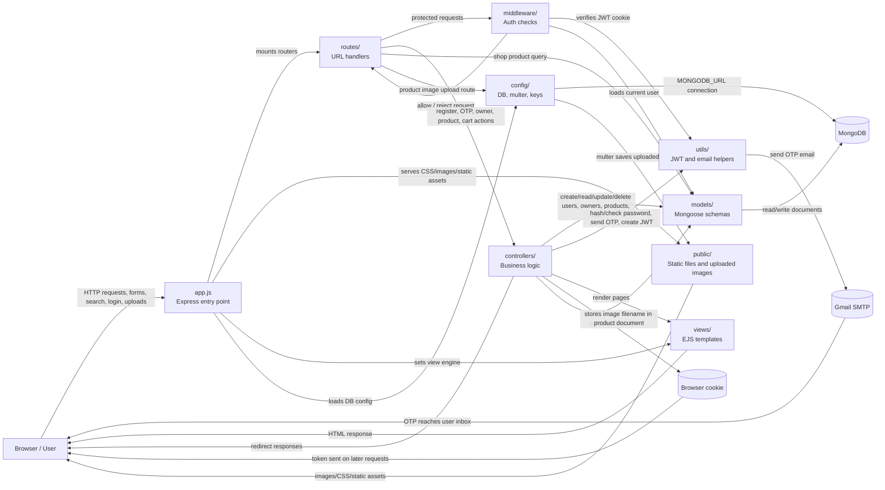

# BagVerse Folder Data Flow Diagram

This DFD shows how data moves between the main folders in the BagVerse Express app.

## Folder Mapping

| From folder/file | To folder/file | Data moving |
| --- | --- | --- |
| `Browser` | `app.js` | HTTP requests, form data, login data, search filters, uploaded product images |
| `app.js` | `routes/` | Requests are forwarded to `index`, `users.routes`, `owners.routes`, `products.routes`, and `auth.routes` |
| `app.js` | `config/` | Loads MongoDB connection and app configuration |
| `app.js` | `public/` | Serves static images and frontend assets |
| `routes/` | `middleware/` | Protected routes pass through login/admin checks |
| `middleware/` | `utils/` | JWT token verification uses the secret from environment/config |
| `middleware/` | `models/` | Logged-in user is loaded from MongoDB |
| `routes/` | `controllers/` | User, owner, product, and cart actions are delegated to controller functions |
| `routes/index.js` | `models/product.model.js` | Shop page searches and filters products directly |
| `controllers/` | `models/` | Creates, reads, updates, and deletes users, owners, products, and cart data |
| `controllers/auth.controller.js` | `utils/sendOtpMail.js` | OTP is sent to the user's email |
| `controllers/auth.controller.js` | `utils/generateToken.js` | JWT token is generated after login/verification |
| `controllers/product.controller.js` | `public/images/` | Product image filename points to uploaded image saved by multer |
| `config/multer.config.js` | `public/images/` | Uploaded product image files are stored here |
| `models/` | `MongoDB` | Mongoose schemas read and write database documents |
| `controllers/` and `routes/` | `views/` | EJS templates are rendered with products, user, cart, flash messages, etc. |
| `views/` | `Browser` | HTML pages are returned to the user |

## Main Flows

### User registration and OTP

`Browser -> app.js -> routes/users.routes.js -> controllers/auth.controller.js -> models/user.model.js -> MongoDB`

Then:

`controllers/auth.controller.js -> utils/sendOtpMail.js -> Gmail SMTP -> User inbox`

After OTP verification:

`controllers/auth.controller.js -> utils/generateToken.js -> Browser cookie -> /shop`

### User login and shop

`Browser -> app.js -> routes/users.routes.js -> models/user.model.js -> utils/generateToken.js -> Browser cookie`

Then:

`Browser -> routes/index.js -> middleware/isLoggedIn.js -> models/user.model.js -> models/product.model.js -> views/pages/shop.ejs -> Browser`

### Cart

`Browser -> routes/index.js -> middleware/isLoggedIn.js -> controllers/cart.controller.js -> models/user.model.js`

For cart display:

`models/user.model.js -> populate cart from models/product.model.js -> views/pages/cart.ejs -> Browser`

### Owner/admin product management

`Browser -> routes/owners.routes.js -> controllers/owner.controller.js -> models/owner.model.js -> Browser cookie`

Admin page:

`Browser -> middleware/isAdmin.js -> controllers/owner.controller.js -> models/product.model.js -> views/pages/createproducts.ejs`

Create/update product:

`Browser upload/form -> routes/products.routes.js -> config/multer.config.js -> public/images/`

And:

`routes/products.routes.js -> controllers/product.controller.js -> models/product.model.js -> MongoDB`

